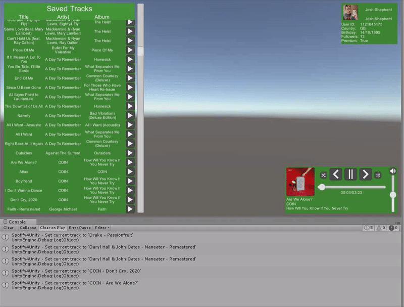

# Spotify4Unity

Spotify4Unity is a plugin which helps you integrate Spotify connectivity into you Unity game/application easily, allowing users to use basic track control functionality to viewing their whole library. This plugin relies heavily on JohnnyCrazy's [SpotifyAPI-NET](https://github.com/JohnnyCrazy/SpotifyAPI-NET)

Check out more and the documentation [on the Wiki](https://github.com/JoshLmao/Spotify4Unity/wiki)

## Requirements

1. Unity 2018.2.0f2 or above
2. Scripting Runtime Version: .NET 4.6

## Quick Start

1. Download the latest UnityPackage build <!--ToDo-->
2. Install into your Unity project
3. Drag in the "QuickControl" prefab into your scene

## License

Spotify4Unity is available under the [MIT license](https://choosealicense.com/licenses/mit/) which allows you to use this for personal or commercial use. Check the [License](LICENSE) for more information

## Donations

If you want to support my plugin and my works, please consider buying me a coffee (or two! ;D)

